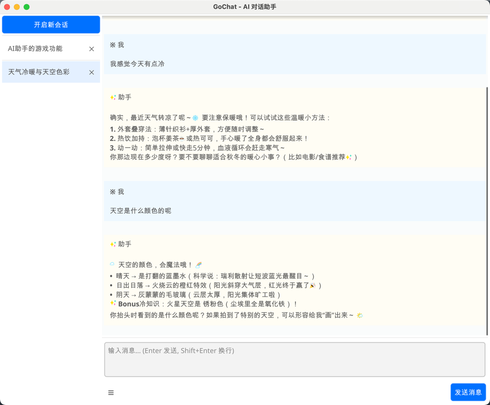

# GoChat - AI 对话助手

一个基于 Go + Fyne + Eino 开发的跨平台 AI 聊天应用，支持流式对话、会话管理和 Markdown 渲染。

## ✨ 功能特性

- 🎨 **清新界面** - 简洁美观的 UI 设计，支持自定义主题
- 💬 **流式对话** - 实时显示 AI 回复，支持 Markdown 格式
- 📝 **会话管理** - 自动保存聊天历史，支持多会话切换
- 🤖 **智能标题** - 自动生成会话标题，方便管理
- 🗄️ **本地存储** - 基于 SQLite 的持久化存储
- 🎯 **快捷操作** - 支持 Enter 发送、Shift+Enter 换行

## 📸 效果图



## 🚀 快速开始

### 前置要求

- Go 1.23.7 或更高版本
- 支持 Fyne GUI 的操作系统（macOS、Windows、Linux）

### 安装

```bash
# 克隆项目
git clone https://github.com/wangle201210/gochat.git
cd gochat

# 安装依赖
go mod tidy

# 构建并运行
go build -o gochat cmd/gochat/main.go
./gochat
```

## ⚙️ 配置

首次运行时，程序会在 `~/.gochat/` 目录下创建配置文件和数据库。

### 配置文件位置

- **macOS/Linux**: `~/.gochat/config.json`
- **Windows**: `%USERPROFILE%\.gochat\config.json`

### 配置示例

```json
{
  "ai": {
    "provider": "openai",
    "model": "gpt-4o-mini",
    "api_key": "sk-your-api-key-here",
    "base_url": "https://api.openai.com/v1"
  },
  "assistant": {
    "provider": "openai",
    "model": "gpt-4o-mini",
    "api_key": "sk-your-api-key-here",
    "base_url": "https://api.openai.com/v1"
  },
  "ui": {
    "window_width": 1000,
    "window_height": 700
  }
}
```

### 配置说明

#### AI 配置（主对话模型）

- `provider`: AI 服务提供商（当前支持 `openai`）
- `model`: 模型名称（如 `gpt-4o-mini`、`gpt-4` 等）
- `api_key`: OpenAI API 密钥
- `base_url`: API 基础地址（支持 OpenAI 兼容接口）

#### Assistant 配置（会话标题生成模型）

用于自动生成会话标题的 AI 模型配置，参数同上。可以使用更便宜的模型以节省成本。

#### UI 配置

- `window_width`: 窗口宽度（默认 1000）
- `window_height`: 窗口高度（默认 700）

### 获取 API Key

#### OpenAI

1. 访问 [OpenAI Platform](https://platform.openai.com/)
2. 注册并登录
3. 进入 [API Keys](https://platform.openai.com/api-keys) 页面
4. 创建新的 API Key
5. 将 Key 配置到 `config.json`

#### 兼容服务

支持所有 OpenAI API 兼容的服务：

- **Azure OpenAI**: 修改 `base_url` 为 Azure endpoint
- **Cloudflare AI Gateway**: 使用 Cloudflare 的代理地址
- **本地模型** (Ollama、LocalAI): 修改为本地地址
- **其他代理服务**: 任何 OpenAI 兼容接口

## 📖 使用说明

### 基本操作

1. **发送消息**: 在输入框输入内容，按 `Enter` 发送
2. **换行**: 按 `Shift + Enter` 在消息中换行
3. **新建会话**: 点击左侧"开启新会话"按钮
4. **切换会话**: 点击左侧会话列表中的会话
5. **删除会话**: 点击会话右侧的 `✕` 按钮
6. **隐藏会话列表**: 点击底部的 `☰` 按钮

### 快捷键

- `Enter` - 发送消息
- `Shift + Enter` - 换行

## 🏗️ 项目结构

```
gochat/
├── cmd/
│   └── gochat/
│       └── main.go              # 程序入口
├── internal/
│   ├── config/
│   │   └── config.go            # 配置管理
│   ├── models/
│   │   ├── message.go           # 消息模型
│   │   └── session.go           # 会话模型
│   ├── service/
│   │   ├── ai/
│   │   │   └── service.go       # AI 服务
│   │   └── assistant/
│   │       └── assistant.go     # 助手服务（标题生成）
│   ├── storage/
│   │   └── database.go          # SQLite 数据库
│   └── ui/
│       ├── custom_entry.go      # 自定义输入框
│       ├── fixed_width_container.go
│       ├── handlers.go          # 事件处理
│       ├── message_card.go      # 消息卡片
│       ├── session_list.go      # 会话列表
│       ├── theme.go             # 主题定义
│       └── window.go            # 主窗口
├── config.example.json          # 配置示例
├── go.mod
├── go.sum
└── README.md
```

## 🛠️ 技术栈

- **[Go](https://go.dev/)** - 编程语言
- **[Fyne v2](https://fyne.io/)** - 跨平台 GUI 框架
- **[Eino](https://github.com/cloudwego/eino)** - CloudWeGo AI 开发框架
- **[SQLite](https://www.sqlite.org/)** - 本地数据库（via mattn/go-sqlite3）
- **[OpenAI API](https://platform.openai.com/)** - AI 模型接口

## 🔧 构建

### 本地构建

```bash
go build -o gochat cmd/gochat/main.go
```

### 跨平台构建

**macOS (Apple Silicon):**
```bash
GOOS=darwin GOARCH=arm64 go build -o gochat-darwin-arm64 cmd/gochat/main.go
```

**macOS (Intel):**
```bash
GOOS=darwin GOARCH=amd64 go build -o gochat-darwin-amd64 cmd/gochat/main.go
```

**Windows:**
```bash
GOOS=windows GOARCH=amd64 go build -o gochat.exe cmd/gochat/main.go
```

**Linux:**
```bash
GOOS=linux GOARCH=amd64 go build -o gochat-linux cmd/gochat/main.go
```

## 🎨 主要特性说明

### 流式对话

使用 Eino 的流式 API，实时显示 AI 回复，提供流畅的用户体验。

### 会话管理

- 自动保存聊天历史到本地 SQLite 数据库
- 支持创建、切换、删除会话
- 智能生成会话标题（基于对话内容）
- 会话列表按时间排序

## 🤝 贡献

欢迎提交 Issue 和 Pull Request！

## 📝 许可证

MIT License

## 🙏 致谢

- [Fyne](https://fyne.io/) - 优秀的跨平台 GUI 框架
- [Eino](https://github.com/cloudwego/eino) - CloudWeGo AI 开发框架
- [OpenAI](https://openai.com/) - AI 模型支持

## 📮 联系方式

如有问题或建议，欢迎通过 GitHub Issues 联系。
